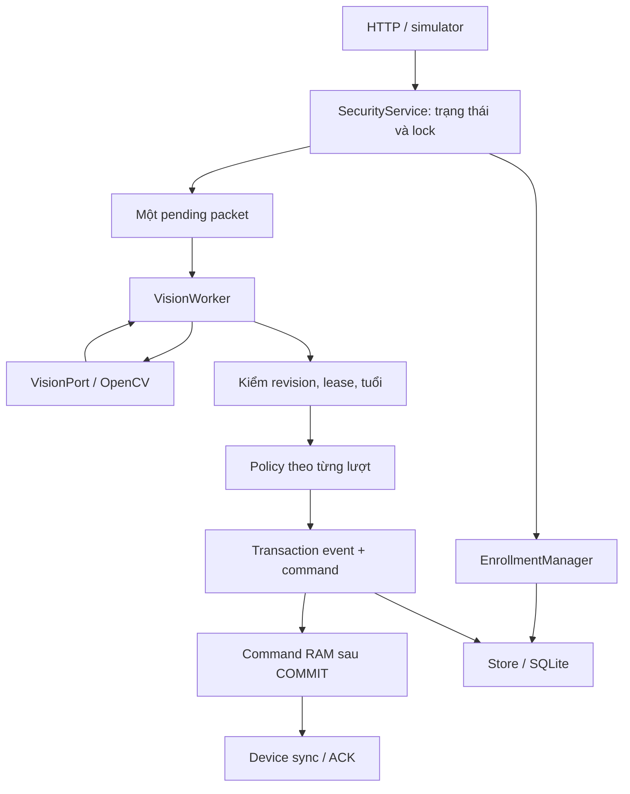

# Bộ khung và ranh giới triển khai — v2.1

Đọc sau TEAM_GUIDE để biết **sửa ở đâu, ghép với ai và kiểm bằng gì**.
Đây là bản đồ code, không thêm một bộ yêu cầu thay SPEC/CONTRACTS.

## 1. Quyết định giữ code

Giữ modular monolith: một ứng dụng FastAPI, SQLite local, dashboard cùng origin,
một worker AI và một ESP32. Bản gốc có nền hữu ích và 49 test chạy được; chưa có
cơ sở kết luận phần lớn implementation sai để xóa toàn bộ. Bản này sửa lỗi và tách
đúng các trách nhiệm đang tập trung trong `service.py`, không bàn giao hàng loạt
file rỗng rồi yêu cầu nhóm đoán cách ghép.

**Đây là nền triển khai đã review, chưa phải bài tập lớn đã hoàn thành.** Nhóm vẫn
phải hiểu code mình sở hữu, kiểm board/camera, thu dữ liệu, hiệu chỉnh, tích hợp và
làm báo cáo. Nếu giảng viên yêu cầu thành viên tự viết một phần từ đầu, dùng cùng
interface/test và thay **một module trong một issue**; không cần phá bộ khung.

## 2. Bản đồ thư mục

| Vị trí | Vai trò | Owner |
|---|---|---|
| `README.md` | Cài/chạy và thứ tự đọc | C |
| `AGENTS.md` | Quy tắc ngắn cho Codex | C + nhóm |
| `docs/TEAM_GUIDE.md` | Hiểu sản phẩm, trigger, demo và nhóm | Cả nhóm |
| `docs/SPEC.md`, `CONTRACTS.md` | Hành vi và giao tiếp cần tuân thủ | Cả nhóm |
| `docs/ARCHITECTURE.md` | Ranh giới này; không lặp thuật toán/spec | Cả nhóm |
| `docs/PLAN.md`, `VALIDATION.md` | Backlog/gate và cách đo | Cả nhóm |
| `docs/RESEARCH.md`, `REVIEW.md` | Nguồn kỹ thuật; bằng chứng review | Đọc khi task cần |
| `backend/security_app/main.py` | HTTP/auth dependencies, bounds, response | C |
| `auth.py` | Admin session, CSRF, device token | C |
| `contracts.py` | Request và Observation có validation | A/B/C cùng review |
| `runtime.py` | DomainError, Packet, monotonic clock | C |
| `service.py` | Chủ trạng thái dùng chung, lock, command/session/revision/event | C |
| `enrollment.py` | Capture lease, hai lượt, staging, gallery lifecycle | B + C |
| `worker.py` | Một thread sở hữu model, lấy pending, chạy inference, publish có guard | C + B |
| `ports.py` | VisionPort cho AI adapter/test double | B + C |
| `vision.py` | OpenCV/quality/association/extraction | B |
| `tracking.py` | Tracker thuần bbox, độc lập OpenCV/DB | B |
| `matching.py`, `spatial.py`, `policy.py` | So khớp, vùng, temporal/per-visit decisions | B; C review policy |
| `storage.py`, `migrations/` | SQLite transaction, upgrade, retention/backup | C |
| `notifications.py` | Outbox Telegram tùy chọn, mặc định tắt | C, sau core |
| `static/`, `templates/` | Dashboard và enrollment operator | C |
| `firmware/security_node/security_node.ino` | Setup + ba task capture/control/alarm | A |
| `firmware/security_node/NodeState.h` | Kiểu state/message trước Arduino auto-prototypes | A + C |
| `AlarmLogic.h`, `FrameFreshness.h` | Logic thuần C++ kiểm được trên máy không board | A |
| `sketch.yaml`, `secrets.example.h` | Build profile ghim; mẫu cấu hình local | A |
| `configs/` | Defaults, hardware override mẫu, calibration seed | B + C |
| `models/manifest.json`, `vendor/`, `licenses/` | Khóa artifact/wrapper/license | B |
| `tools/manage.py` | Provision, doctor, backup/restore | C |
| `tools/device_simulator.py`, `smoke_integration.py` | Thiết bị giả và kiểm HTTP local | A + C |
| `tools/download_models.py`, `record_visit.py`, `evaluate.py` | Model và dataset/evaluation | B |
| `tools/check.py` | Một lệnh kiểm software cho người/agent | C |
| `tests/` | Test hành vi, lỗi, race, migration và firmware host | Owner code + reviewer |
| `experiments/` | Evidence software hiện tại, template HIL/report | Cả nhóm |
| `.github/` | CI và template issue/PR | C |

`runtime/`, `data/`, `backups/`, `configs/local.yaml`, calibration local và
`secrets.h` chỉ có ở máy nhóm, ignored Git. ONNX tải riêng, không đóng trong ZIP.
Repo cần chạy từ checkout + editable install; **chưa hỗ trợ wheel cài độc lập**
vì config/models/tools ở root. Không phát hành pip package như một sản phẩm đã hỗ trợ.

## 3. Dòng dữ liệu và ownership



- **SecurityService** sở hữu state và RLock duy nhất. EnrollmentManager/worker là
  composition, tham chiếu coordinator rõ ràng; không tạo bản sao mode/gallery/session.
  API gọi public method của service; không sửa field bằng endpoint mới tùy tiện.
- **OpenCV chỉ dùng trong worker.** `VisionPort.analyze` nhận JPEG, snapshot gallery
  và monotonic time; trả Observation[]. Không gọi DB/GPIO/network trong AI adapter.
  `vision_factory` chỉ là dependency injection trong Python để test race; HTTP/config
  không được chọn fake model trong profile hardware.
- **Policy** không I/O. Một frame có một observation/track. Nhận decision, không
  nhận “người lạ toàn ảnh”. Kết quả policy chưa chứng minh actuator đã chạy.
- **Transaction:** persist event/command trước; `_deliver_committed` mới công bố cho
  sync. Hỏng DB phải DISARMED/clear memory. Không giữ lệnh chưa commit rồi hy vọng
  handler lỗi chạy nhanh hơn một sync khác.
- **Lock:** chỉ giữ quanh state/DB ngắn; JPEG decode và model inference ngoài lock.
  SQLite/media vẫn có thể làm tăng control latency, cần đo G4. Không tuyên bố realtime
  chỉ vì có ba thread/task. Hard OFF vẫn do firmware độc lập bảo vệ.
- **Firmware:** alarm task là GPIO owner sau setup. Control task enqueue command có
  session/revision/queuedAt; alarm task kiểm lại tại execution. Capture task không
  được điều khiển còi hoặc giữ framebuffer sau lần trả.

## 4. Bất biến khi thêm tính năng

1. Mode/session/gallery thay đổi vô hiệu kết quả đang chạy. Capture đổi round tăng
   revision; lease còn hạn lúc publish mới được dùng mẫu.
2. Một in-flight + một pending; không thêm queue vô hạn hoặc retry ảnh cũ.
3. Tâm body bbox quyết định A/B; face-only không có quyền tạo incoming.
4. Mờ/không mặt/mơ hồ không bỏ phiếu UNKNOWN. Unknown không có nghĩa có ý xấu.
5. Alarm event, command delivery, ACK và buzzer_reported là các lớp trạng thái riêng.
6. STOP không bị alarm mới ghi đè; cooldown không hẹn phát âm muộn.
7. Model/calibration/geometry đổi có hash/version và gate tương ứng; không mở arm
   bằng cách sửa seed validated, bỏ test hoặc dùng sample giả.
8. Schema thay thêm `002_*.sql` trở đi; runner atomic và từ chối schema tương lai.
   Khi muốn đổi SQL đã áp dụng, viết migration mới + test nâng từ schema cũ.

## 5. Ghép nhóm bằng interface, không bằng nhánh lớn

| Người | Có thể làm khi không giữ board | Bàn giao sớm | Không tự đổi |
|---|---|---|---|
| A | C++ host logic, đọc sync/ACK fixture, compile sketch | Payload hello/sync/frame hợp CONTRACTS, build/HIL | Mode/policy/nhận diện của server |
| B | Pure matching/tracker, test double VisionPort, dataset tool | Observation đúng bbox/identity/geometry, report lỗi | Event/command/DB lifecycle |
| C | API/simulator/DB/UI, race test với BlockingVision | Cách chạy thống nhất, command state/UI/error | Model/threshold đã freeze hoặc logic GPIO |

`enrollment.py` do B triển khai nghiệp vụ với C review transaction/revision;
`service.py` không còn là nơi để cả ba đồng thời nhét mọi code. Đổi CONTRACTS phải
có PR ghép producer và consumer. Dùng branch theo issue, không branch theo người.

## 6. Thứ tự mở code để tự review

1. Chạy simulator unknown; quan sát event → command → ACK → OFF.
2. Đọc `contracts.Observation`, `spatial.zone_for`, rồi `policy.ingest` cùng
   `tests/test_policy.py`: giải thích được vì sao A → B mới có incoming.
3. Đọc `service.accept` → `worker.run` → `service._publish`: theo một packet và
   chỉ ra các điểm kiểm stale/revision/lease/transaction.
4. Đọc `enrollment.py`: draft → round1 → round2 → commit draft → activate; thử
   cancel/timeout/đổi round. Đọc `test_worker_boundaries.py` để thấy race thật.
5. Đọc `service.sync`/`_issue` và `AlarmLogic.h`/controlTask/alarmTask; giải thích
   event đỏ chưa chứng minh còi kêu, duplicate không kéo deadline.
6. Đọc `vision.py` sau cùng với ảnh thật của nhóm; model load PASS không có nghĩa
   quality/tracker/threshold đạt. Đo ở VALIDATION trước chỉnh tham số.

## 7. Khởi động task với Codex

`AGENTS.md` → issue trong PLAN → FR/contract liên quan → module/test cụ thể.
Không bắt agent nạp toàn bộ RESEARCH/REVIEW mỗi task; không thêm nhiều prompt file
chứa cùng một spec. Prompt ngắn đủ dùng:

```text
Làm issue <ID> trong docs/PLAN.md. Đọc AGENTS.md và tài liệu liên quan, kiểm tra code
hiện tại rồi triển khai đúng scope. Chạy test phù hợp; báo phần đã làm, kết quả và
những gì còn cần người/board kiểm chứng. Dừng ở gate của issue này.
```

Nhóm chỉ merge khi người review giải thích được input/output và xem evidence,
không chỉ dựa vào câu “agent đã làm xong”.
